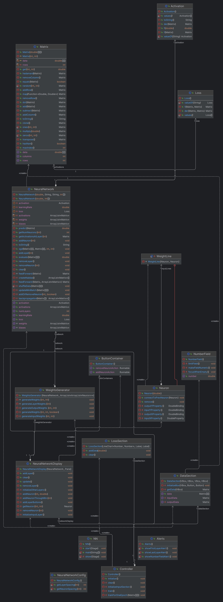
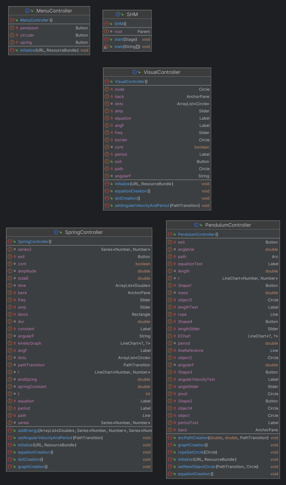

# NCPS (Neural Network - Cipher - Physics - Simulation)

## How to get started
1. Clone the repository
2. Open the repository in your favorite IDE
3. Run the Main.java file

## Neural Network UML Diagram

## Physics UML Diagram
